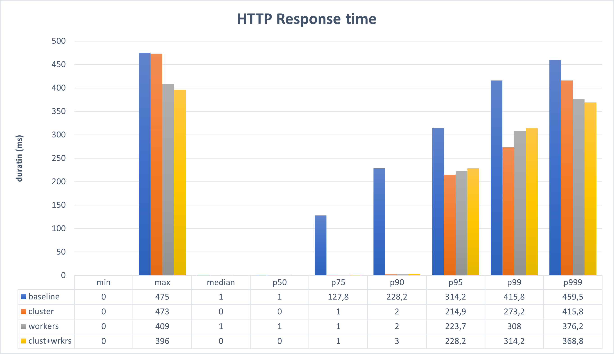
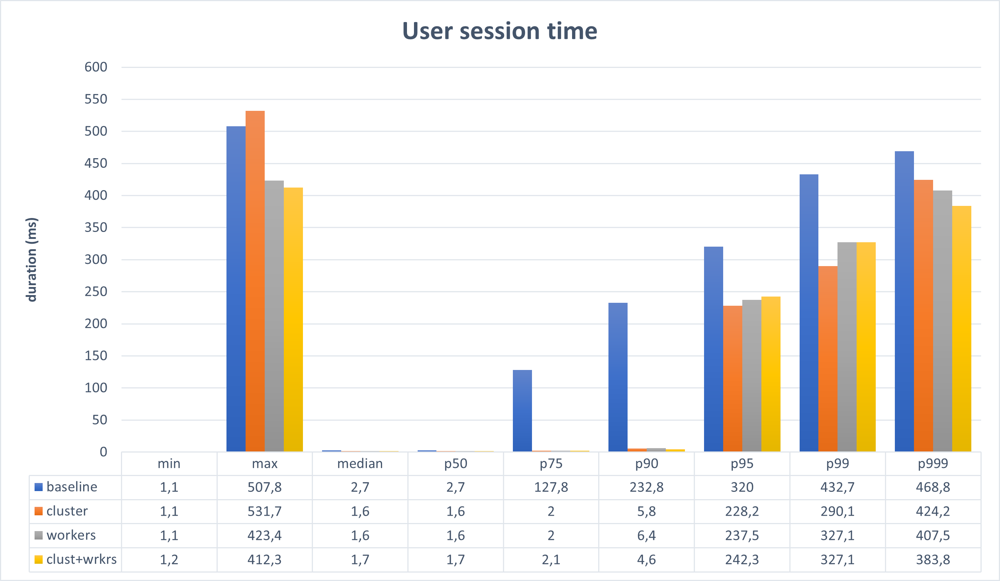

# Node multithreading performance test

This is a small project to measure the influence of using various "multi-threading" methods on a nodejs project with the [CSS](https://github.com/CommunitySolidServer/CommunitySolidServer) in mind.
## Installation

```bash
npm i -g artillery
npm i
```

This will generate two files:

path | description
---  | -----
`/reports/benchmark.json`| Raw results
`/reports/benchmark.json.html`| HTML report of results

## The application

The application is a simple Nodejs HTTP server with three endpoints:

endpoints | description
----------| -----------
`/short` | prints hello world.
`/long?total=xxx` |  generates a timeseries formatted as a JSON Array with random values.
 `/config` |  prints if workers are enabled.

 ## Tests
 
 A scenario has been written using Artillery, it can be found in [test.yaml](test.yaml). Artillery creates virtual users that call target URLs. The scenario goes like this:

 * For 10 seconds:
    * Increase virtual users with 1/sec.
    * Up to 10 concurrent users maximum.
 * For 20 seconds:
    * Increase virtual users with 5/sec.
    * Linearly scale up to 50/sec
 * For 20 seconds:
    * Increase virtual users with 50/sec.
    * Up to 250 concurrent users maximum.

While doing this, there is a 95% chance the short request is taken and a 5% chance the long request is taken. The long request generates a timeseries of length 500k.

 ### Baseline

This is the application running as is.

```bash
# Start the server in 1 terminal
npm start

# Run benchmark in other terminal
npm run benchmark
cp reports/benchmark.json results/baseline.json
cp reports/benchmark.json.html results/baseline.json.html
```

**Resuls**

   * results/baseline.json
   * results/baseline.json.html

### Cluster approach

Using [pm2](https://pm2.keymetrics.io/) we will now start the application in cluster mode. This will effectively start `nr-of-cpus - 1` processes that all listen to the same port. In a round robin fashion, the main thread will let the child processes handle the requests. 

```bash
# global install pm2
npm i -g pm2 

# compile application
npm run build

# start processes
pm2 start dist/index.js -i "-1"
```

### Worker_thread approach

Using [workerpool](https://www.npmjs.com/package/workerpool) we will now start the application and create a worker_thread pool. This pool will only be used for executing the timeseries generation of the `/long` endpoints.

```bash
# start with workers enabled
npm start -- --workers
```

### Cluster + worker_thread approach

Combining both techniques at the same time
```bash
# start pm2 with workers enabled
pm2 start dist/index.js -i -1 -- --workers
```

## Test results




## Discussion

Looking a these results the clustering approach seems an obvious win. However some caveats and explanation might be warranted.

**About clustering**

The concept of clustering in nodejs is interesting, it allows for an easy way of utilizing more cpu threads/cores. All of this with minimal changes to the code. In essence, one instance is the Main instance, and child processes are forked from that process. They each run the complete runtime of nodejs, but for intance can listen to the same port.

This leads to the main drawback, since every process runs the entire nodejs stack, the RAM requirements are pretty high. Essentially you are trading memory for cpu. 

**About worker_threads**

The concept of worker_threads in nodejs allows for lightweight _application_ (read: not the same as OS threads, this is still at the discretion of the OS thread scheduler) threads to be run in parallel. In theory this is an ideal case, it does not require extra RAM for running the nodejs stack and it allows the main event loop to never be blocked or stalled. 

The initial reaction was to try out two approaches for the CSS:

   1. Accept incoming requests on the main thread, and immediatly dispatch calculcating the respone to a workers_thread. Once the response is available, the main thread gets called and responds to the original requset.
   2. Make a worker_thread pool that can be leveraged for long running tasks (i.e. the programmer knows this is going to be long running, thus uses the worker_thread pool).

In practice however there are some major drawbacks with both these scenarios. Data going to and from workers_threads needs to be serialized. This effectively means:

   * Arguments are always serialized and thus copied.
   * Complex arguments need to be serializable
   * Dynamically calling functions (not knwon which ones beforehand, like nr 1. above) requires serializing the whole function to send it to the worker.
   * Function return values follow the same requirements (serialized/serializable/copied)
   * Functions must completely rely on their own scope and variables. They cannot be dependent on outer scoped variables.

Mapping this to the cases above, this means:

   1. In the CSS this is not feasable as a simple change. All the current Handlers have a `request: IncomingMessage` and `response: ServerResponse` object as argument. This can never work, since both objects (particularly the reponse object) are serialized and copied. This means the response object is not the same one connected to the initial opened Socket and thus never responds. To make this work the Handler interface should include method signatures like this: `handle(request: IncomingMessage): String`. The response would then be returned as the string that will be send to the original ServerResponse object (in the main thread).

      In case of the CSS this is a very large and deep change, which I feel is not warranted. Even more so, because already it is clear that a lot of overhead time would be spent serializing input data to the workers.
   2. This approach is a bit more feasable, because the programmer can decide whether to use the worker pool or not. It could allow for interesting gains if there are tasks that require a lot of calculation, but not a lot of serialization (i.e. input arguments are small).

      Another way to look at this is that you don't really care if the serialization makes it take longer to respond, because instead the main eventloop is freed up from any cpu-intesive tasks it had to perform. 

      Important to not here is that even if offloaded to a worker pool, programmers should still be wary of partitioning their workload. [[1](https://nodejs.org/en/docs/guides/dont-block-the-event-loop/#partitioning)] [[2](https://nodejs.org/en/docs/guides/dont-block-the-event-loop/#task-partitioning)]

## Conclusion

In conclusion given the case of the CSS, clustering seems the best tradeoff for required-work vs performance-gain. Creating a computational worker pool API in the CSS to offer to developers might be interesting, but only if said developers see value in writing their code in such a way that they would actually benefit from it.